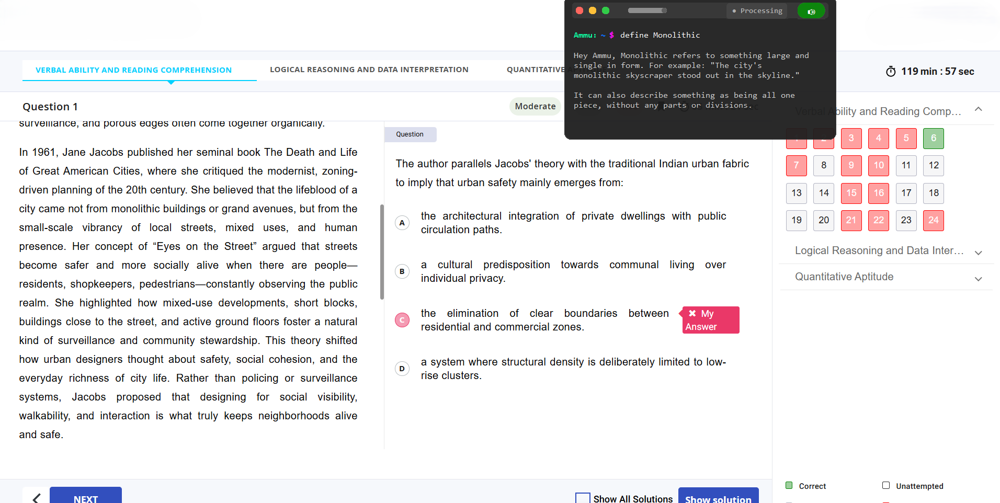
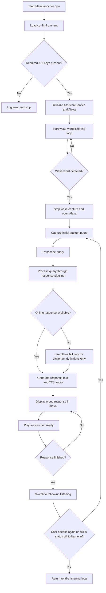

# Alexa

A modular, voice-triggered desktop assistant with a floating Alexa. The app listens for a wake word, captures a spoken request, routes the query through online and offline response paths, and shows the result in a compact window while text-to-speech audio is prepared and played.

## Overview

The project is split into small modules so the UI, runtime loop, configuration, and assistant logic stay separated:

- `MainLauncher.pyw` starts the app.
- `assistant_app/AppRuntime.py` owns the main wake-word loop.
- `assistant_app/AppConfig.py` loads environment settings and validates required keys.
- `assistant_app/AssistantService.py` handles wake-word detection, transcription, routing, speech generation, playback, and cleanup.
- `assistant_app/CardUi.py` renders the floating Alexa and manages follow-up interactions.
- `assistant_app/Logger.py` provides structured logging.

## Features

- (Custom) Wake-word activation for hands-free use.
- Floating Alexa with query, response, and status display and auto-timeout.
- Follow-up listening after a response completes.
- Barge-in support to interrupt active speech or processing.
- Text-to-speech output with audio playback cleanup.
- Online response routing with fallback behavior for simple definition-style queries.
- Alexa controls for theme switching, pinning, closing, opacity adjustment, and audio mute/unmute.
- Meeting mode: listens to the PC's own system/loopback audio (e.g. a Zoom or Teams call) instead of the microphone, transcribes what's said, and types the answer in the widget - handy for getting live answers to questions asked in a meeting.
- Chat history: the last 3 questions and answers stay on screen in a scrollable list, so you don't lose the earlier ones when you ask something new.
- Copy buttons: grab a single answer or the whole visible conversation with one click.
- A small drag handle above the toolbar for moving the window around.

## Two Themes

The interface includes two visual themes and can be used as a wonderful overlaying dictionary as well.

| Theme 1 | Theme 2 |
| --- | --- |
|  |  |

### Overlay View

This screenshot shows the Alexa working as an overlaying dictionary on top of another app.



## Alexa Controls

The floating Alexa is split into three areas: a drag handle on top, a toolbar with all the buttons, and the response area below it.

### Drag handle

A small bar sits right above the toolbar, centered. It's just there to grab and move the window - nothing else. It's red on Theme 1 and green on Theme 2, so it's always easy to spot against either background.

### Toolbar

Left to right, this is what's in the toolbar:

- 🟢 Green button: switches between the two themes.
- 🟡 Yellow button: pins or unpins the Alexa so it stays open.
- 🔴 Red button: closes the window.
- Opacity slider: adjusts how see-through the window is.
- 📋 Copy-all button: copies the whole visible conversation (up to the last 3 questions and answers) to the clipboard in one click.
- 🖥 Meeting-mode button: toggles listening to the PC's system audio (loopback) instead of the mic. While active, the Alexa is auto-pinned open and its own TTS is muted, so it just types out answers to whatever it hears in the call. Requires Windows with a WASAPI loopback device (`PyAudioWPatch`); the button is greyed out if unavailable.
- Speaker button: mutes or unmutes assistant audio playback.
- Status pill: shows what the assistant is doing right now (Mic Off, Listening, Transcribing, Processing). Click it while the assistant is processing or transcribing to barge in and interrupt the current response.

### Response area

- Keeps the last 3 questions and their answers on screen instead of wiping out the previous one - just scroll up to see what was asked before.
- A scrollbar shows up when the conversation gets longer than the window, styled to match whichever theme is active.
- ⧉ Copy button: each answer has its own small copy button next to its question, so you can grab just that one answer.
- You can also right-click an answer, or press Ctrl+C, to copy the most recent one.

## Setup

### 1. Install dependencies

```bash
pip install -r requirements.txt
```

### 2. Configure environment variables

Create a `.env` file in the project root with at least these required values:

```env
GROQ_API_KEY_1=your_primary_groq_key
GEMINI_API_KEY_1=your_primary_gemini_key
```

Optional values:

```env
USER_NAME=User
WAKE_WORD=alexa
GROQ_API_KEY_2=optional_additional_key
GEMINI_API_KEY_2=optional_additional_key

GREET_USER=true
SYSTEM_INSTRUCTION="You are a fast, minimalist assistant. Explain using layman's terms and avoid bombastic definitions. When defining words, include one example sentence. Answer in 1 or 2 sentences."
UNPIN_TIMEOUT_SECONDS=5
INITIAL_THEME=light
ALWAYS_MUTE=false
```

`GROQ_API_KEY_1` and `GEMINI_API_KEY_1` are mandatory. The app will not start without them. Only `alexa` and `jarvis` are supported as the wake word for now.

Here's what the optional ones do:

- `GREET_USER`: if `true`, every response starts with "Hey `<USER_NAME>`, ...". If `false`, it just answers directly.
- `SYSTEM_INSTRUCTION`: the preset instruction sent to the API on every call. Change this to change how Alexa answers.
- `UNPIN_TIMEOUT_SECONDS`: how many seconds the widget stays open after being unpinned (or if it was never pinned) before it auto-closes.
- `INITIAL_THEME`: `light` or `dark` - the theme the widget opens with. This gets rewritten automatically whenever you switch themes in the widget, so it remembers the last one you used.
- `ALWAYS_MUTE`: if `true`, Alexa starts muted every time the widget opens (you can still unmute it from the widget). If `false`, it works as usual.

## Run

Start the application from the project root:

```bash
python MainLauncher.pyw
```

## Runtime Flow

The assistant follows a fixed interaction pipeline. The flowchart below shows the full path from startup to follow-up listening.



## How the Flow Works

1. The launcher loads configuration and validates required API keys.
2. The runtime keeps reading the microphone until the wake word is detected.
3. Once triggered, the Alexa opens immediately and the initial query is captured.
4. The spoken query is transcribed and sent through the response pipeline.
5. If the online route cannot answer a definition-style query, the assistant falls back to offline dictionary definitions only.
6. The Alexa types the query and answer while audio is prepared in the background.
7. After the response finishes, the app returns to follow-up listening.
8. If no follow-up is spoken, the assistant returns to the idle wake-word loop.

## Project Notes

- The Alexa is intentionally compact and floating so it stays unobtrusive.
- The response cycle is guarded so stale callbacks or old playback threads do not interfere with the current interaction.
- Follow-up listening is controlled explicitly and does not start automatically on window open.
- The green, yellow, and red Alexa buttons control theme switching, pinning, and closing respectively.
- The status pill doubles as a barge-in control during processing or transcription.
- The speaker button toggles mute and unmute for assistant audio playback.
- The opacity slider adjusts the transparency of the floating Alexa.
- Offline fallback is limited to dictionary-style definition queries only.

## Repository Layout

```text
FLOW.md
HelloDemo.py
MainLauncher.pyw
requirements.txt
ui.html
assistant_app/
  __init__.py
  AppConfig.py
  AppRuntime.py
  AssistantService.py
  CardUi.py
  Logger.py
```

## License

No license file is included in this repository.
