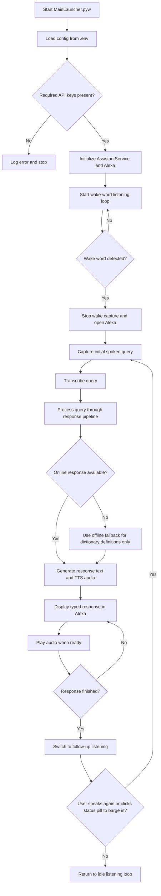

# Alexa

A modular, voice-triggered desktop assistant with a floating Alexa. The app listens for a wake word, captures a spoken request, routes the query through online and offline response paths, and shows the result in a compact window while text-to-speech audio is prepared and played.

## Overview

The project is split into small modules so the UI, runtime loop, configuration, and assistant logic stay separated:

- `MainLauncher.pyw` starts the app.
- `assistant_app/AppRuntime.py` owns the main wake-word loop.
- `assistant_app/AppConfig.py` loads environment settings and validates required keys.
- `assistant_app/AssistantService.py` handles wake-word detection, transcription, routing, speech generation, playback, and cleanup.
- `assistant_app/CardUi.py` renders the floating Alexa and manages follow-up interactions.
- `assistant_app/Logger.py` provides structured logging.

## Features

- Wake-word activation for hands-free use.
- Floating Alexa with query, response, and status display.
- Follow-up listening after a response completes.
- Barge-in support to interrupt active speech or processing.
- Text-to-speech output with audio playback cleanup.
- Online response routing with fallback behavior for simple definition-style queries.
- Alexa controls for theme switching, pinning, closing, opacity adjustment, and audio mute/unmute.

## Alexa Controls

The floating Alexa uses color-coded controls so the interaction stays simple:

- Green button: toggles between the available themes.
- Yellow button: pins or unpins the Alexa so it stays open.
- Red button: closes the window.
- Status pill: click while the assistant is processing or transcribing to barge in and interrupt the current response.
- Opacity slider: adjusts the transparency of the Alexa window.
- Speaker button: mutes or unmutes assistant audio playback.

## Setup

### 1. Install dependencies

```bash
pip install -r requirements.txt
```

### 2. Configure environment variables

Create a `.env` file in the project root with at least these required values:

```env
GROQ_API_KEY_1=your_primary_groq_key
GEMINI_API_KEY_1=your_primary_gemini_key
```

Optional values:

```env
USER_NAME=User
WAKE_WORD=alexa
GROQ_API_KEY_2=optional_additional_key
GEMINI_API_KEY_2=optional_additional_key
```

`GROQ_API_KEY_1` and `GEMINI_API_KEY_1` are mandatory. The app will not start without them.

## Run

Start the application from the project root:

```bash
python MainLauncher.pyw
```

## Runtime Flow

The assistant follows a fixed interaction pipeline. The flowchart below shows the full path from startup to follow-up listening.



## How the Flow Works

1. The launcher loads configuration and validates required API keys.
2. The runtime keeps reading the microphone until the wake word is detected.
3. Once triggered, the Alexa opens immediately and the initial query is captured.
4. The spoken query is transcribed and sent through the response pipeline.
5. If the online route cannot answer a definition-style query, the assistant falls back to offline dictionary definitions only.
6. The Alexa types the query and answer while audio is prepared in the background.
7. After the response finishes, the app returns to follow-up listening.
8. If no follow-up is spoken, the assistant returns to the idle wake-word loop.

## Project Notes

- The Alexa is intentionally compact and floating so it stays unobtrusive.
- The response cycle is guarded so stale callbacks or old playback threads do not interfere with the current interaction.
- Follow-up listening is controlled explicitly and does not start automatically on window open.
- The green, yellow, and red Alexa buttons control theme switching, pinning, and closing respectively.
- The status pill doubles as a barge-in control during processing or transcription.
- The speaker button toggles mute and unmute for assistant audio playback.
- The opacity slider adjusts the transparency of the floating Alexa.
- Offline fallback is limited to dictionary-style definition queries only.

## Repository Layout

```text
FLOW.md
HelloDemo.py
MainLauncher.pyw
requirements.txt
ui.html
assistant_app/
  __init__.py
  AppConfig.py
  AppRuntime.py
  AssistantService.py
  CardUi.py
  Logger.py
```

## License

No license file is included in this repository.
